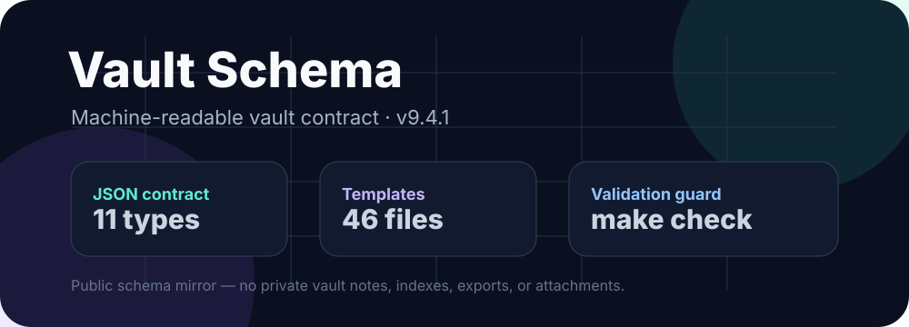

# Vault Schema



**Vault Schema** is the public, machine-readable schema contract for a structured Obsidian vault: note types, frontmatter fields, canonical folders, filename patterns, templates, examples, generated JSON Schema, and validation expectations.

This repository is the standalone schema mirror for the current vault contract. The canonical machine-readable source is [`vault-schema.json`](vault-schema.json). [`life-os-schema.yaml`](life-os-schema.yaml) is a generated legacy export, and [`life-os-schema.md`](life-os-schema.md) is the prose companion.

## Current contract

| Field | Value |
| --- | --- |
| Schema version | `9.4.1` |
| Updated | `2026-06-08` |
| Core note types | `11` |
| Areas | `4` |
| Status values | `6` |
| Templates included | `46` |
| JSON Schema | [`dist/vault-schema.schema.json`](dist/vault-schema.schema.json) |
| Contract meta-schema | [`schema/vault-schema.contract.schema.json`](schema/vault-schema.contract.schema.json) |
| Docs site | https://viggomeesters.github.io/vault-schema/ |
| Public safety boundary | schema/templates only; no private vault notes or indexes |

## Repository layout

```text
vault-schema/
├── vault-schema.json        # Canonical machine-readable schema contract
├── life-os-schema.yaml      # Generated legacy YAML export
├── life-os-schema.md        # Prose documentation companion
├── templates/               # Frontmatter/content templates mirrored from the vault contract
├── examples/                # Synthetic public-safe examples per note type
├── dist/                    # Generated JSON Schema, checksums, release bundle
├── site/                    # GitHub Pages static docs
├── scripts/validate_repository.py
├── tests/test_validate_repository.py
├── docs/                    # Architecture, roadmap, release and maintainer docs
└── assets/vault-schema-hero.svg
```

## Quick start

```bash
git clone https://github.com/viggomeesters/vault-schema.git
cd vault-schema
make check
```

`make check` creates a repo-local `.venv`, installs `requirements.txt`, regenerates derived artifacts, validates schema semantics, validates synthetic examples, and builds the release bundle/checksums.

Use the JSON contract directly from automation:

```python
import json
from pathlib import Path
schema = json.loads(Path("vault-schema.json").read_text())
print(schema["version"])
```


## Validation tools

```bash
make check
make note-validate
make compat-diff
```

- `schema/vault-schema.contract.schema.json` validates the shape of canonical `vault-schema.json`.
- `dist/vault-schema.schema.json` validates note frontmatter and now includes type/category/area conditionals.
- `scripts/validate_note.py <note.md>` validates Markdown frontmatter against the generated JSON Schema plus semantic contract checks.
- `scripts/diff_schema_compatibility.py <old> <new>` reports type, field, location, and category compatibility changes for files or `git-ref:path` inputs.

## Agent usage

Agents should treat `vault-schema.json` as the canonical contract. YAML/prose/templates are compatibility and helper surfaces.

1. Read `vault-schema.json` first.
2. Use `types.*.location`, `filename_patterns`, `core_fields`, and `context_fields` to decide canonical write locations.
3. Only use inbox/quarantine paths when classification is genuinely unclear.
4. Preserve provenance fields (`source`, `source_id`, `thread_id`, `project_slug`, `topics`) for automated captures.
5. Run `make check` after schema/template edits.

## Safety boundary

This repo contains the public schema contract and reusable templates only. It must not contain private vault notes, generated indexes, cache databases, Telegram exports, email content, or personal attachments.

## Related docs

- [Architecture](docs/ARCHITECTURE.md)
- [Roadmap](docs/ROADMAP.md)
- [Repo-complete checklist](docs/REPO_COMPLETE.md)
- [Maintainer checklist](docs/MAINTAINER_CHECKLIST.md)
- [Package / release notes](docs/PACKAGE.md)
- [Generated schema reference](docs/generated-schema-reference.md)
- [Compatibility report v9.4.1](docs/compatibility/v9.4.1.md)
- [Docs site](https://viggomeesters.github.io/vault-schema/)

## License

MIT. See [LICENSE](LICENSE).
